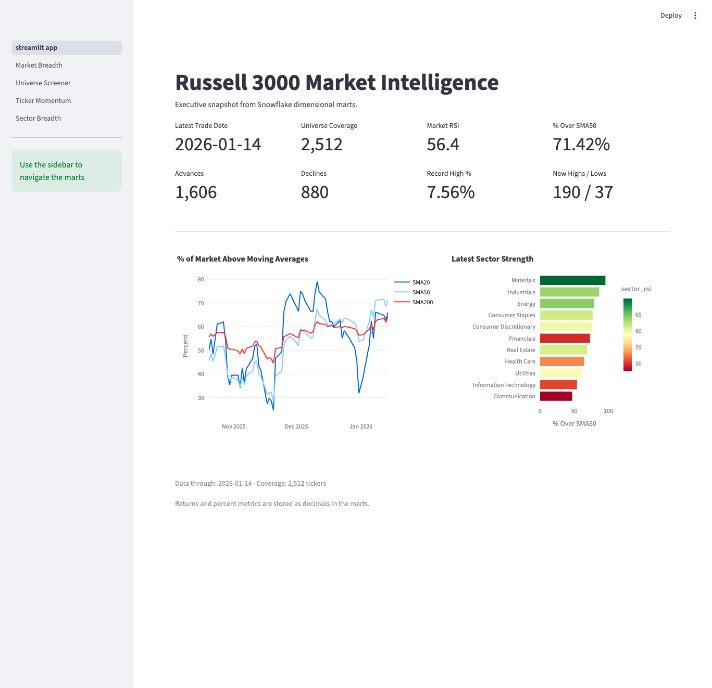
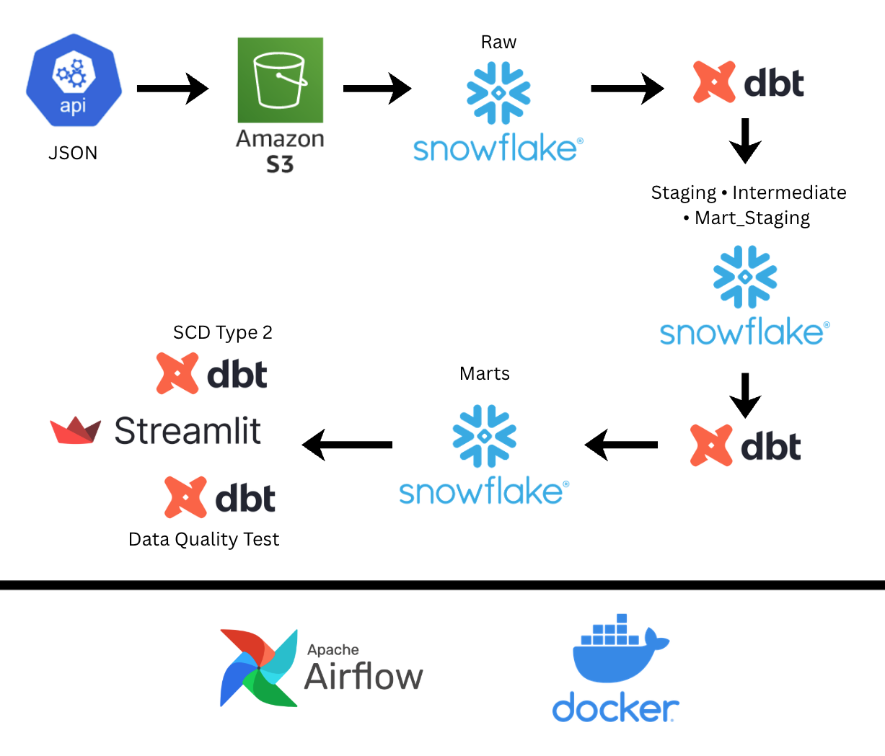
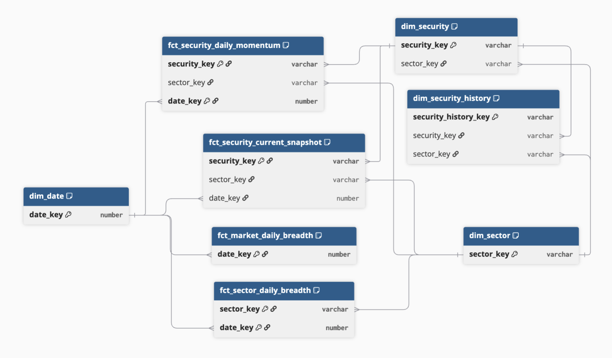

# Stock Market Data Analytics Pipeline

A production-style batch ELT pipeline for Russell 3000 market intelligence.
Daily OHLCV data flows from Polygon.io (now Massive.com) through an Amazon S3
raw archive into Snowflake, where dbt builds tested dimensional marts used
by a hosted Streamlit dashboard.

**[Open the live Russell 3000 Market Intelligence dashboard](https://russell3000-market-intelligence.streamlit.app/)**

> The dashboard is a historical snapshot because paid source ingestion
> is currently paused. The pipeline remains fully implemented and restartable.

<p align="center">
  
</p>

## Architecture

<p align="center">
  
</p>

The diagram groups `STAGING`, `INTERMEDIATE`, and `MART_STAGING` into one
transformation section for readability. They remain separate schemas in the
`MARKET` Snowflake database.

| Concern | Technology | Role |
|---|---|---|
| Source | Polygon.io / Massive.com | Grouped daily U.S. stock aggregates |
| Raw archive | Amazon S3 | Replayable source JSON |
| Warehouse | Snowflake | Raw landing, transformation compute, and dimensional marts |
| Transformation | dbt Core | SQL models, incremental loads, SCD Type 2, and tests |
| Orchestration | Apache Airflow | Scheduled ingestion, transformations, and quality checks |
| Local runtime | Docker Compose | Reproducible Airflow environment |
| Analytics | Streamlit | Hosted market, sector, security, and momentum dashboards |

Scoped AWS IAM permissions and key-pair authentication secure access between
services.

## What It Demonstrates

- **Replayable ingestion:** source JSON is archived in S3 before Snowflake
  loading, allowing recovery and reprocessing.
- **Reliable loading:** idempotent daily loads and ingestion checkpoints support
  safe retries without duplicate data.
- **Layered ELT:** `RAW -> STAGING -> INTERMEDIATE -> MART_STAGING -> MARTS`,
  with business transformations run by dbt inside Snowflake.
- **Incremental processing:** dbt models efficiently process new and affected
  trading dates while keeping rolling indicators accurate.
- **Dimensional modeling:** conformed date, security, and sector dimensions are
  shared by a small fact constellation.
- **Historical dimensions:** SCD Type 2 tracks changes to Russell 3000
  security attributes over time.
- **Data quality:** dbt tests validate keys, relationships, business rules,
  historical validity, and aggregate accuracy.
- **Analytics delivery:** four Streamlit views show market breadth, sector
  breadth, universe screening, and ticker momentum.
- **Meaningful scale:** the historical dataset contains approximately 5.88
  million raw records across 539 trading dates.

## Dimensional Marts

<p align="center">
  
</p>

The primary security-day star shares conformed date, security, and sector
dimensions with market-day, sector-day, and current-snapshot facts. Together
they form a small fact constellation, with an additional SCD Type 2 security
history dimension.

## Pipeline Run

Airflow runs the pipeline on a weekday schedule and enforces this order:

```text
Extract + S3 archive + Snowflake RAW load
  -> dbt STAGING
  -> dbt INTERMEDIATE
  -> dbt MART_STAGING
  -> dbt MARTS
  -> dbt tests
```

NYSE calendar logic selects completed trading dates, while Russell 3000
constituent seeds provide point-in-time membership and descriptive attributes.

## Reliability

- S3 archival includes secure storage and integrity validation.
- Ingestion checkpoints track progress and support recovery after failures.
- dbt tests cover structural integrity, transformation logic, SCD Type 2
  history, and aggregate reconciliation.
- Historical raw data can be reconstructed without calling the provider API.

## Quick Start

Prerequisites: Docker Compose, Snowflake, AWS credentials for the scoped
ingestion identity, an RSA private key, and a Massive.com/Polygon.io API key if
source ingestion will be resumed.

```bash
git clone https://github.com/KevDev7/stock_market_data_pipeline.git
cd stock_market_data_pipeline
cp .env.example .env
docker compose up -d
```

Airflow is available at `http://localhost:8080`. See the setup guide before
provisioning a new S3/Snowflake integration or enabling the DAG.

## Documentation

- [Architecture and data model](docs/architecture.md)
- [Environment and installation](docs/setup.md)
- [Operations, backfills, and testing](docs/operations.md)
- [Example Snowflake queries](examples/queries.sql)
- [Environment variable template](.env.example)

## Limitations

- Source ingestion is paused, so the hosted dashboard represents a historical
  portfolio snapshot rather than a real-time service.
- The universe is limited to the available Russell 3000 constituent snapshots.
- Adjusted aggregates are requested, but history is not automatically reloaded
  when a provider applies retroactive corporate-action changes.
- This is an educational portfolio deployment, not a production SLA-backed
  service; Snowflake and market-data usage can incur costs when resumed.

## Vendor Naming

Polygon.io rebranded as [Massive.com](https://massive.com/blog/polygon-is-now-massive)
on October 30, 2025. Historical metadata, environment variables, S3 paths, and
the supported `api.polygon.io` endpoint retain their original names because the
historical data was ingested under the Polygon.io brand.

## License

This project is for educational and portfolio purposes.
