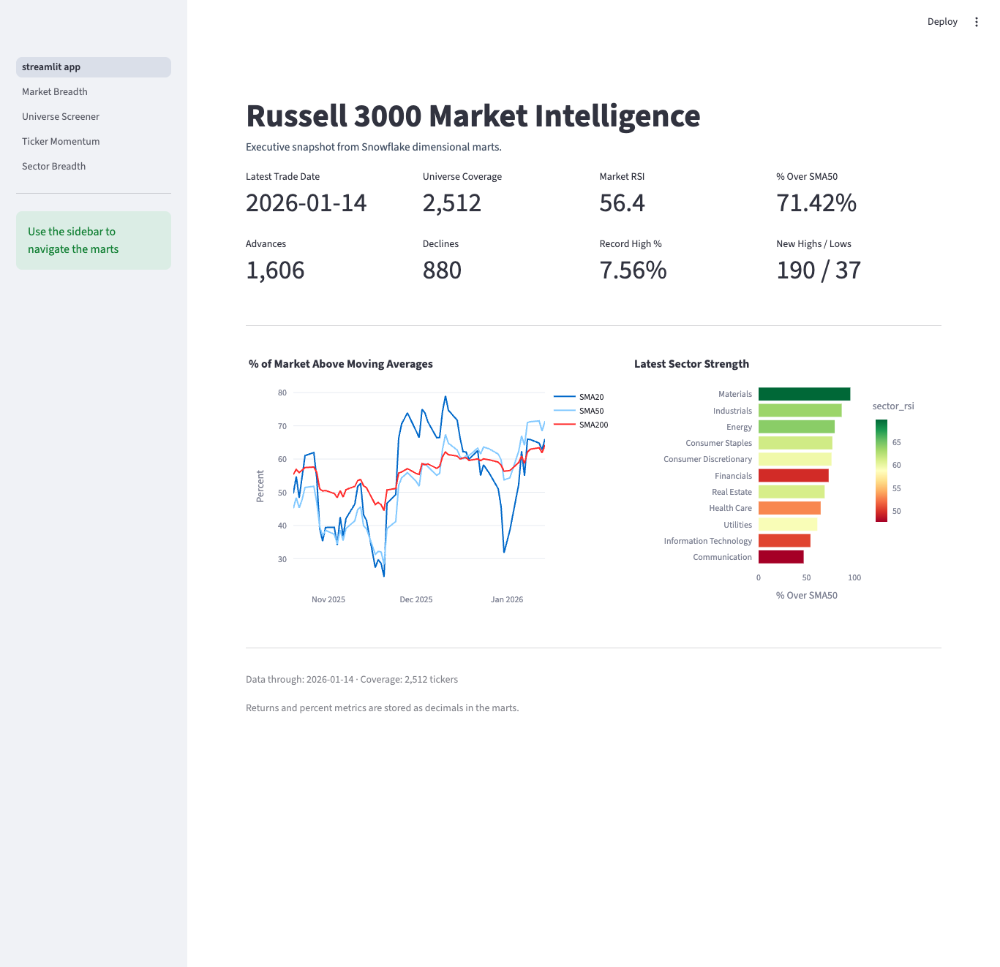
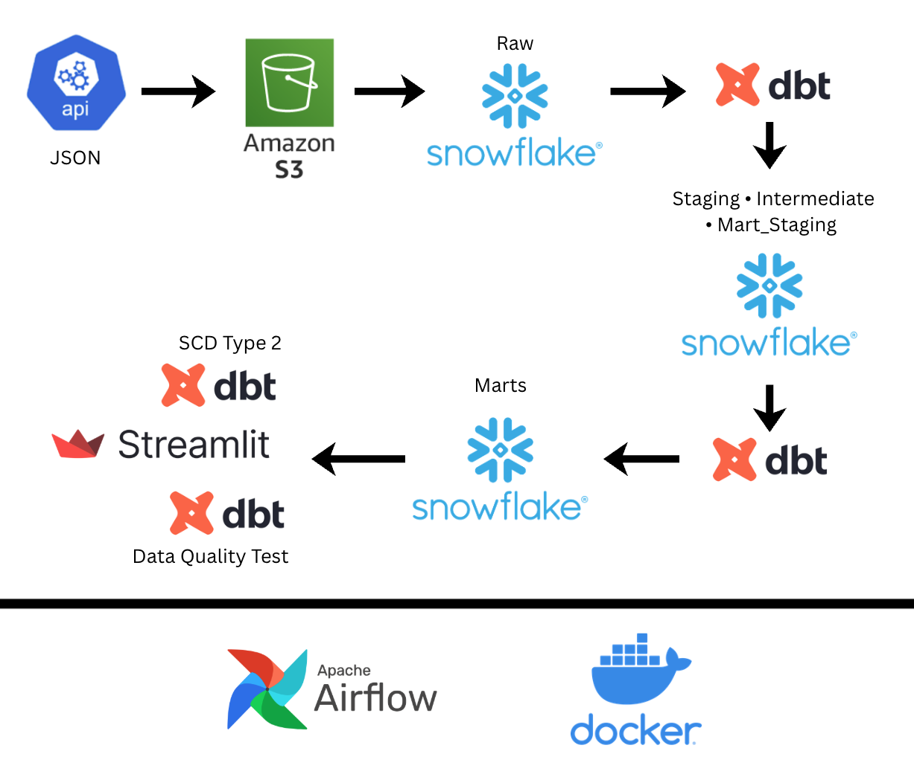
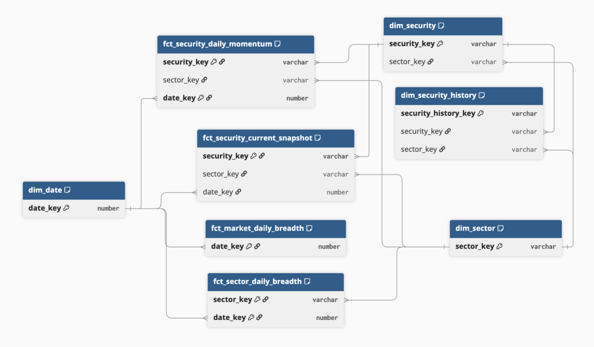

# Stock Market Data Analytics Pipeline

A production-style batch ELT pipeline for historical U.S.-listed stock analytics.
Daily OHLCV data flows from Polygon.io (now Massive.com) through an Amazon S3
raw archive into Snowflake, where dbt builds tested dimensional marts used
by a hosted Streamlit dashboard.

**[Open the hosted dashboard](https://russell3000-market-intelligence.streamlit.app/)**

> The reporting window is 2024–2025. The hosted application now labels the
> provider-classified common-stock universe and SIC industry groups explicitly.
> Its URL retains the legacy Russell 3000 name. It deploys from
> `codex/warehouse-marts-scd2`, not `main`.

<p align="center">
  
</p>

## Data Architecture

<p align="center">
  
</p>

## Vendor Architecture

<p align="center">
  
</p>

This vendor overview is retained alongside the data architecture above.
Its `Mart_Staging` label reflects the earlier design; the current pipeline has
four processing layers, with that work consolidated into `MARTS`.

| Concern | Technology | Role |
|---|---|---|
| Source | Polygon.io / Massive.com | Grouped daily prices, dated ticker catalogs, and issuer overviews |
| Raw archive | Amazon S3 | Replayable source JSON |
| Warehouse | Snowflake | Raw landing, transformation compute, and dimensional marts |
| Transformation | dbt Core | SQL models, incremental loads, SCD Type 2, and tests |
| Orchestration | Apache Airflow | Scheduled ingestion, transformations, and quality checks |
| Local runtime | Docker Compose | Reproducible Airflow environment |
| Analytics | Streamlit | One dashboard with market, industry, security, and momentum views |

Scoped AWS IAM permissions and key-pair authentication secure access between
services.

## What It Demonstrates

- **Replayable ingestion:** source JSON is archived in S3 before Snowflake
  loading, allowing recovery and reprocessing.
- **Reliable loading:** idempotent daily loads and ingestion checkpoints support
  safe retries without duplicate data.
- **Layered ELT:** `RAW -> STAGING -> INTERMEDIATE -> MARTS`,
  with business transformations run by dbt inside Snowflake.
- **Incremental processing:** dbt models replace recent correction windows,
  remove stale records, and warm rolling indicators with accepted observations.
- **Dimensional modeling:** conformed date, security, and sector dimensions are
  shared by a small fact constellation.
- **Historical dimensions:** SCD Type 2 compresses observed daily security-attribute changes;
  daily eligibility comes from dated provider catalogs.
- **Data quality:** dbt tests validate keys, relationships, business rules,
  historical validity, and aggregate accuracy.
- **Analytics delivery:** four Streamlit views show market breadth, industry-group
  breadth, universe screening, and ticker momentum.
- **Meaningful scale:** 8.27 million retained raw price records and 2.57 million
  reporting security-day facts across 502 exchange sessions. The migration adds
  252 warmup sessions and refreshes adjusted prices while retaining original archives.

## Dimensional Marts

<p align="center">
  
</p>

The primary security-day star shares conformed date, security, and sector
dimensions with market-day, sector-day, and current-snapshot facts. Together
they form a small fact constellation, with an additional SCD Type 2 security
history dimension.

## Pipeline Run

Airflow runs the pipeline on a weekday schedule and enforces this order:

```text
Extract + S3 archive + Snowflake RAW load
  -> Reference API + S3 archive + Snowflake RAW load
  -> dbt STAGING
  -> dbt INTERMEDIATE
  -> dbt MARTS
  -> dbt tests
```

Daily dated catalogs establish provider-CS eligibility and security identity.
Quarterly issuer overviews plus first-observed issuers supply SIC industry metadata.
The active marts cover 2024–2025; 252 earlier exchange sessions warm indicators.
The four legacy CSV seeds remain as inactive provenance, not an analytical input.

## Reliability

- S3 archival includes secure storage and integrity validation.
- Ingestion checkpoints track progress and support recovery after failures.
- dbt tests cover structural integrity, transformation logic, SCD Type 2
  history, and aggregate reconciliation.
- Historical raw data can be reconstructed without calling the provider API.

## Quick Start

Prerequisites: Docker Compose, Snowflake, AWS credentials for the scoped
ingestion identity, an RSA private key, and a Massive.com/Polygon.io API key if
source ingestion will be resumed.

```bash
git clone https://github.com/KevDev7/stock_market_data_pipeline.git
cd stock_market_data_pipeline
cp .env.example .env
docker compose up -d
```

Airflow is available at `http://localhost:8080`. See the setup guide before
provisioning a new S3/Snowflake integration or enabling the DAG.

## Documentation

[Documentation index](docs/README.md)

## Vendor Naming

Polygon.io rebranded as [Massive.com](https://massive.com/blog/polygon-is-now-massive)
on October 30, 2025. Historical metadata, environment variables, S3 paths, and
the supported `api.polygon.io` endpoint retain their original names because the
historical data was ingested under the Polygon.io brand.

## License

This project is for educational and portfolio purposes.
