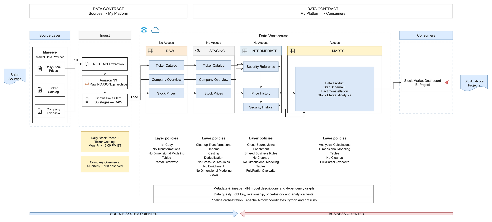

# Architecture and Data Model

## Visual Architecture



The drawing follows the reference diagram's visual structure: functional-zone
headers, dashed boundaries, colored processing-layer headers, dataset boxes,
technology annotations, right-angle data-flow arrows, layer-policy blocks,
shared-capability bands, and wavy-bottom category labels.

[Edit in diagrams.net](../assets/stock-market-architecture.drawio) or use the
[scalable SVG](../assets/stock-market-architecture.svg). Dataset boxes can group
multiple models; they do not imply one table per box. The reference migration
was applied on 2026-10-07; see [verified migration results](reference-migration-results.json).
On 2026-10-08, the warehouse was consolidated into these four processing layers
after a complete 15-model build and 109 passing warehouse tests. All eight
published tables retain their column contracts, grains, and row counts; the
removed processing schema remains under a recovery backup name. See
[four-layer verification](four-layer-refactor-results.json). The separate
[hosted dashboard deployment](hosted-dashboard-deployment-results.json) was
completed on 2026-10-07 and all five hosted views were verified.

The `.drawio` file is the editable diagram for future revisions. After editing
it, export fresh SVG and PNG copies locally using Draw.io Desktop:

```sh
sh scripts/export_architecture_diagram.sh
```

The official `drawio@drawio` Codex plugin and Draw.io Desktop were installed
and native exports verified on 2026-10-08. The `.drawio.png` and `.drawio.svg`
exports contain the editable XML; the shorter `.png` and `.svg` filenames are
identical copies used by existing documentation links. The source `.drawio`
is retained. No browser upload or raster image generation is needed.

The initial diagram can also be rebuilt from the shared shape model in
`scripts/build_architecture_diagram.py`:

```sh
python3 scripts/build_architecture_diagram.py
```

Rebuilding overwrites the `.drawio` and SVG files, so first synchronize any
manual Draw.io changes into the builder, or intentionally choose to discard
those changes. Re-run the native export command after rebuilding. No external
icons or fonts are needed.

## Data Flow

### Ingestion

`src/extraction.py` requests grouped daily aggregates from Polygon.io (now
Massive.com) with `adjusted=true`. The ingestion code adds four operational
fields and keeps each source row as JSON in `RAW_PAYLOAD`:

- `API_DATE`: requested market date
- `RUN_ID`: ingestion run identifier
- `SOURCE`: historical source name, `polygon_grouped_daily`
- `INGESTED_AT`: landing timestamp

`src/load.py` writes these rows as gzip NDJSON to:

```text
s3://<bucket>/raw/polygon/grouped-daily/
  api_date=<date>/run_id=<run-id>/daily_stocks_raw.ndjson.gz
```

After archival succeeds, Snowflake loads the same object through the external
stage. The load atomically replaces the matching `API_DATE` in
`RAW.DAILY_STOCKS_RAW`, making retries idempotent. S3 remains the replayable file
archive.

### Reference Sources

Massive daily catalogs and quarterly issuer overviews use the same raw envelope
and are archived under raw/massive/reference/<source>/api_date=.../run_id=....
REFERENCE_MANIFEST records complete source/date counts and archive checksums.
Incomplete pagination or archive/COPY count mismatches fail before publication.

The migration refreshes retained split-adjusted prices to the same retrieval
vintage as newly fetched warmup prices. Old S3 versions remain intact and a
Snowflake clone preserves pre-refresh prices. Otherwise later stock splits can
create artificial discontinuities where old and newly fetched history meet.
Historical versions beyond the active reporting window remain retained.

### Snowflake Layers

| Schema | Responsibility | Main objects |
|---|---|---|
| `RAW` | Queryable source landing | `DAILY_STOCKS_RAW`, `REFERENCE_RAW`, source manifests, external stages |
| `STAGING` | Standardize each source, resolve duplicates, flag invalid prices | `STG_DAILY_STOCKS`, `STG_MARKET__CATALOG`, `STG_MARKET__ISSUER_OBSERVATIONS` |
| `INTERMEDIATE` | Daily eligibility and identity; observed industry enrichment; accepted price and attribute history | `INT_MARKET__REFERENCE_DAILY`, `INT_MARKET__DAILY`, `INT_MARKET__SECURITY_HISTORY` |
| `MARTS` | Calculate analytical measures and aggregates; build facts and dimensions | Shared `CALC_SECURITY_DAILY_MOMENTUM` helper, four dimensions, and four facts |
| `SEEDS` | Inactive legacy constituent snapshots; not a current dependency | Legacy `RUSSELL3000_*` objects |
| `ADMIN` | Operational ingestion state | `INGESTION_CHECKPOINTS` |

This is a batch ELT design: extraction and landing occur before dbt executes
business transformations inside Snowflake. Pre-load processing is limited to
operational metadata and wrapping each source row as JSON.

### Layer Policies

The four processing layers have explicit responsibility boundaries:

`Preserve -> Standardize -> Combine and establish history -> Calculate and publish`

| Policy category | RAW | STAGING | INTERMEDIATE | MARTS |
|---|---|---|---|---|
| Output purpose | Queryable source landing | Reusable standardized sources | Accepted security-days and observed attribute history | Analytical measures, aggregates, facts, and dimensions |
| Source-copy policy | Preserve source fields in a JSON envelope with operational metadata | Source records normalized to each source's declared grain | Combine dated sources using shared eligibility and identity rules | Derive measures and publish modeled facts and dimensions |
| Allowed transformations | Serialization and operational metadata | Parse, rename, cast, source deduplication, quality flags | Eligibility, identity keys, SIC grouping, joins, accepted-close and observation history, SCD change boundaries | Rolling indicators, rankings, aggregates, conformed dimensions, fact projections |
| Analytical modeling | No facts or dimensions | No cross-source business models | Shared enriched base, not a dimensional serving model | Shared analytical helper and consumer facts and dimensions |
| Write behavior | Atomic source/date replacement; missing-price backfills append | Replace view definitions | Reference/history: full rebuild; daily: replace recent date window | Momentum helper/fact: replace recent date window; other models: full rebuild |
| Storage format | Snowflake-native table containing JSON text | Views over Snowflake tables | Snowflake-native tables | Snowflake-native tables |
| Published object type | Internal table | Internal views | Internal tables | Tables; dashboard queries the eight DIM_/FCT_ products |

MARTS owns all analytical measures. Its `_shared/calc_security_daily_momentum.sql`
model computes the reusable rolling measures once, including warmup observations.
The market-breadth, industry-breadth, and current-snapshot fact models calculate
their own product-specific results directly; separate preparation/fact pairs and
the MART_STAGING processing schema are no longer required. A helper model inside
a layer is not an additional layer or another dashboard product. INTERMEDIATE
retains identity, eligibility, source integration, and accepted record/history
preparation, but not RSI, moving averages, breadth, or screening calculations.

`SEEDS` retains disabled legacy snapshots and `ADMIN` contains operational checkpoints;
neither is an extra sequential processing layer. The S3 gzip NDJSON archive is
outside the warehouse boundary and supplies replayable landing records. It is
not a byte-for-byte archive of the original HTTP response.

Source normalization has one home in STAGING. Daily duplicates are selected by
latest ingestion timestamp, descending run ID, then ascending source payload for
repeatable ties. This tie-break is a reproducibility policy, not evidence that a
conflicting value is more accurate. Reference catalogs are standardized at ticker/date grain; issuer observations
at issuer/date grain. No eligibility selection, SIC grouping, identity derivation,
price history, or cross-source enrichment is defined in STAGING.

INTERMEDIATE accepts rows with a ticker, `is_valid_record = 1`, and
`has_volume = 1` before calculating price history. Invalid or zero-volume source
records remain inspectable in RAW/STAGING but cannot affect previous close or
downstream rolling metrics. Price checks are defined in STAGING; INTERMEDIATE
consumes their flags rather than redefining those checks.

`OBSERVATION_COUNT` counts accepted security-identity observations across gaps.
`IS_FIRST_OBSERVATION` marks the first such observation, not a proven index-entry
event. `YESTERDAY_CLOSE` means previous accepted observation's close, which may
precede a gap in the source history.

Daily eligibility comes from a complete dated catalog filtered to provider type
CS, locale us, and active. Quarterly issuer overviews enrich industry attributes;
they do not decide quarter-long membership. First-observed issuers get an initial
overview before the next quarter. Industry labels map SIC major groups; missing
SIC stays Unknown. CIK attaches issuer metadata, while share-class/composite FIGI
is preferred for security identity. Missing FIGI uses CIK+ticker, or exchange+ticker
when CIK is also missing. Temporary when-issued/when-distributed lines retain
separate identities, qualified by ticker and contiguous catalog-observation episode;
they are not merged into ordinary shares just because FIGI matches. See the
[exchange CQS suffix convention](https://www.nasdaqtrader.com/Trader.aspx?id=CQSSymbolConvention).
Explicit source names identify other temporary lines, including Nasdaq's
[fifth-character V convention](https://www.nasdaq.com/glossary/v/v), without
assuming every symbol ending in V is temporary.
Identifier changes can split histories; fallback keys do
not prove full corporate-action continuity.

Attribute changes are compressed in INTERMEDIATE, then published as
DIM_SECURITY_HISTORY. History is based on priced observations, not unpriced alias
rows. Validity windows describe observed attributes, not proof of continuous
listing during gaps. IS_CURRENT means observed on the final dataset date, not
listed today. Prices determine fact eligibility; history and daily enrichment use
exactly the same attributes and identity. Index weights are NULL.

The reporting window is 2024-01-01 through 2025-12-31. Source prices and catalogs
begin on 2022-12-29 to provide 252 prior exchange sessions. Technical windows use
accepted observations rather than calendar-day estimates; sparse/new securities
retain NULL until enough observations exist. RSI uses simple rolling averages of
14 price changes (not Wilder smoothing).
Nonnegative gain/loss sums are clamped at zero to remove floating-window
cancellation residue. Relative volume uses floating division so very small
positive ratios are not rounded to zero by fixed-scale division.

This is dated historical metadata, not a strict as-known-then backtest: Massive
issuer overviews use reporting-period dates, and quarterly observations approximate
change dates. The later appearance of data in a filing is not modeled.

MARTS may select a current dimension row or calculate dimension attributes; that
is dimensional modeling, not another source deduplication pass. Consumer-facing
aliases such as `LATEST_CLOSE` also do not redefine source normalization.

### Diagram Boundaries and Shared Capabilities

An architecture drawing can use functional zones for Sources, Ingest, and
Consumers, and a Snowflake Data Warehouse boundary containing these four layers.
Show API pull, S3 archival, and staged warehouse loading as the implemented paths;
reference metadata is also archived and landed in RAW before STAGING/INTERMEDIATE.
`DIM_SECURITY_HISTORY` consumes shared observed attribute history, so not
every path traverses every layer.

Airflow provides shared orchestration, dbt provides transformations and quality
checks, and model YAML provides dataset descriptions and declared grains. There
is no dedicated semantic serving layer declared in this repository. Streamlit
queries MARTS. The hosted reader's read-only access to the eight published tables
was verified separately, and those grants were preserved during consolidation.
It has no access to the other active processing schemas; retained mart backups
still have reader grants. See [access verification](hosted-dashboard-access-results.json).
Source and consumer expectations can be documented, but
do not imply a negotiated delivery contract or SLA where none is established.

Business decisions already begin with eligibility selection in INTERMEDIATE;
analytical measures begin in MARTS. If orientation arrows are included,
they should acknowledge this transition rather than imply that all business
logic begins exclusively in MARTS.

## Load Behavior

| Target | Load type | Method | Write behavior |
|---|---|---|---|
| `RAW.DAILY_STOCKS_RAW` | Incremental | Partition-based on `API_DATE` | Overwrite one date partition |
| Staging models | No physical row load | Views | Create or replace view |
| `RAW.REFERENCE_RAW` | Dated snapshots | Complete catalog or issuer-observation batch | Atomically replace matching source/date; archive versions retained |
| `INT_MARKET__REFERENCE_DAILY`, `INT_MARKET__SECURITY_HISTORY` | Full | Dated eligibility, identity and attribute history | Rebuild tables |
| `INT_MARKET__DAILY` | Incremental | Recent-date lookback | Atomically replace output date window |
| `MARTS.CALC_SECURITY_DAILY_MOMENTUM` | Incremental | Recent-date output; observation-based warmup | Atomically replace output date window |
| `FCT_SECURITY_DAILY_MOMENTUM` | Incremental | Recent-date lookback | Atomically replace output date window |
| Other marts | Full | Table rebuild | Overwrite table |
| Legacy Russell seeds | Disabled | Retained for provenance | No active load |
| Ingestion checkpoints | Operational log | Per-state event | Append |

Incremental models share `correction_lookback_days` (default: four calendar days
before the target's latest trade date). Query results are frozen in a temporary
table, then the whole output window is deleted and reinserted in one transaction.
This removes records that become invalid, disappear, or lose same-day eligibility; a merge
of surviving keys alone cannot remove them. Momentum calculations also read up
to 252 earlier accepted observations per identity to warm up their windows, rather
than assuming a fixed calendar span contains enough trading observations.
Older source corrections require a larger lookback or a full rebuild.

## Dimensional Model

The marts form a small fact constellation built around a primary security-day
star. Conformed dimensions allow facts at different grains to be analyzed
consistently.

### Dimensions

| Model | Grain | Purpose |
|---|---|---|
| `DIM_DATE` | One row per trading date | Calendar attributes shared by all dated facts |
| `DIM_SECURITY` | One row per identity | Latest observed attributes and reporting-period coverage |
| `DIM_SECURITY_HISTORY` | Identity x validity period | SCD Type 2 observed attribute history |
| `DIM_SECTOR` | One row per SIC major-group label | Shared industry classification; legacy SECTOR names preserve SQL compatibility |

`DIM_SECURITY_HISTORY` uses `VALID_FROM`, `VALID_TO`, and `IS_CURRENT` to retain
attribute versions. It is implemented as a dbt table model rather than a dbt
snapshot.

### Facts

| Model | Grain | Measures |
|---|---|---|
| `FCT_SECURITY_DAILY_MOMENTUM` | Security x trading date | OHLCV, SMAs, RSI, relative volume, crossovers, 52-week levels |
| `FCT_MARKET_DAILY_BREADTH` | Trading date | Advances, declines, A/D metrics, breadth participation, highs/lows |
| `FCT_SECTOR_DAILY_BREADTH` | Sector x trading date | Sector breadth, RSI, participation, and momentum |
| `FCT_SECURITY_CURRENT_SNAPSHOT` | Security | Latest signals, returns, volatility, rankings, and screener flags |

## Orchestration

The Airflow DAG runs these six tasks in strict order:

1. Extract, archive to S3, and load Snowflake RAW
2. Archive/load the same day's catalog and required issuer observations
3. Build dbt staging views
4. Build eligibility, accepted price history, and observed attribute history
5. Build shared analytical calculations and publish marts in dependency order
6. Run dbt tests

The cron schedule is `0 12 * * 1-5` in `America/New_York`. NYSE calendar logic
targets the latest completed trading date, and completed checkpoints prevent
duplicate work.

## Security Boundaries

- The ingestion IAM user can list the grouped-daily and reference prefixes and read/write their
  objects but cannot delete them.
- Snowflake assumes a dedicated read-only IAM role for those same prefixes.
- Docker Compose mounts the project AWS profile as read-only secrets.
- Snowflake clients and Streamlit authenticate with RSA private keys.

The source provider renamed Polygon.io to Massive.com in October 2025. Runtime
identifiers keep the original name for compatibility and an accurate history.
